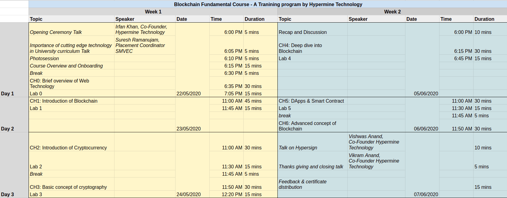

# Blockchain fundamental course
 
## Prerequisite
 
- Download the [Hypersign Mobile App](https://hypermine.in/hypersign/) and Register
- Go to [Aeternity Lab](https://ae-labs.herokuapp.com/) portal and login using Hypersign
- *[Optional]* Create an account on [Github](https://github.com/)
- Join [this](https://chat.whatsapp.com/CIpzHHgMjovLo6hsrlXBZ0) WhatsApp group for questions and discussions
- *[Optional]* Watch [this](https://youtu.be/93E_GzvpMA0) video before joining the course.
 

## Schedule

## Syllabus
 
- Course overview & Onboarding
 
### Chapter 00 : Brief overview of Web Technology (1 hrs)
 
- Fundamental of web technology
- Client-server paradigm
- Three tier architecture
   - Presentation layer
   - Application layer
   - Data layer
- APIs
- Centralized systems
 
**Lab 0**
- Walk through code of a web application to understand the architecture. 
 
### Chapter 01 : Introduction of Blockchain (2 hrs)
 
- Concept of Trust
  - Trust - A Problem!
  - Trust & Centralization - A Problem!
- Peer-To-Peer Model
- Decentralized System
- Distributed System
- Centralized Vs Decentralized Vs Distributed
- What is Blockchain?
- How data is stored in Blockchain?
- Key Characteristics of Blockchain
   - Immutability
   - Anonymity
   - Transparency
   - Decentralization
   - Security
   - Trustless
- A brief history
- Types of Blockchain
   - Public
   - Private
   - Consortium
- Why do we need?
- When to use a Blockchain?
- Uses cases
 
**Lab 1**
- Understanding concepts of [block explorer](https://aeknow.org/)
- Getting familiar with networks: [mainnet](https://mainnet.aeternal.io/generations/258249) and [testnet](https://testnet.aeternal.io/)
 
### Chapter 02 : Introduction of Cryptocurrency (2 hrs)

- Trust Issue in finance
- Incentivization
- What is Cryptocurrency?
- Why do we need Cryptocurrency in Blockchain?
- Cryptocurrency vs Blockchain?    
- Types of cryptocurrency
   - Tokens
   - Coins
   - Token vs Coins
- Wallets
- Types of Wallet
   - Software wallet
       - Web wallet
       - Desktop wallet
       - Mobile wallet
   - Hardware wallet
- Exchange
- Bitcoin & Blockchain
 
**Lab 2**
- Create accounts and play with wallet features on [Ae-Lab](http://ae-labs.herokuapp.com/)
- Install Aeternity wallet and get some token
 
 
### Chapter 03 : Basic concept of cryptography (2 hrs)
 
- Cryptography
- Hashing
- Encryption & Decryption 
- Symmetric key cryptography
- Asymmetric key cryptography
   - Private key
   - Public Key
- Encryption Vs Hashing
- Digital signature
- Importance of cryptography in Blockchain
 
**Lab 3**
- Play with [online tool](https://andersbrownworth.com/blockchain/public-private-keys/keys) to understand keys, signature, hashing etc.
 
 
### Chapter 04 : Deep dive into Blockchain (2 hrs)
 
- Blockchain
- How does Blockchain works?
- Important terminologies
- Node
- Transaction
- Transaction Pool
- Block
- Mining & Proof Of Work
- Block Propagation
- Block Validation
- Chain Formation
- Merkle tree
- Why is it hard to change?
- Consensus
- Types of Consensus
   - Proof of Work
   - Proof of stake
 
**Lab 4**
- Understanding clear concept of Blockchain using a visual [demo](https://andersbrownworth.com/blockchain/)
   - Understanding concepts of Blocks, BlockHeight, Transactions, Fee, BlockHash, Previous block, Nounce
- Play with blockchain transactions on [AE-Lab](http://ae-labs.herokuapp.com/)
   - Build Transaction
   - Sign Transaction
   - Decode Transaction
   - Spend Transaction
 
### Chapter 05 : DApps & Smart Contract (2 hrs)
 
- Decentralise Applications
- What are smart contracts?
- Features of smart contract
- How are smart contracts different from normal code?
- Use cases
- Example of smart contract.
 
 
**Lab 5**
- Writing simple smart contact of To-DoList
- Play with smart contract editor on [AE-Lab](http://ae-labs.herokuapp.com/)
 
### Chapter 06 : Advanced concepts of Blockchain (2 hrs)
 
- Governance
- Naming System
- Off chain and On chain transaction
- Concept of Payment Channel
- Concept of Statechannel
- Concept of Oracles
 
 
## What will you learn?
 
- Understanding core concept of Blockchain
- Concepts of cryptocurrency, token, wallet
- Basic concepts of cryptography
- Understanding concepts of dApps and smart contracts
- Understand Aeternity Blockchain and its ecosystem
- Basic concepts of state channels, oracles, off chain transactions etc.
 

## Resources

- [Blockchain visual demo](https://andersbrownworth.com/blockchain)
- [Blockchain playground](https://blockchaindemo.io/)
- Another [playground](http://ae-labs.herokuapp.com/) with smart contract editor

